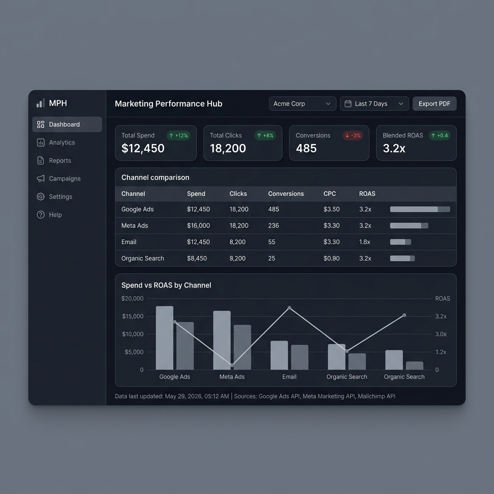
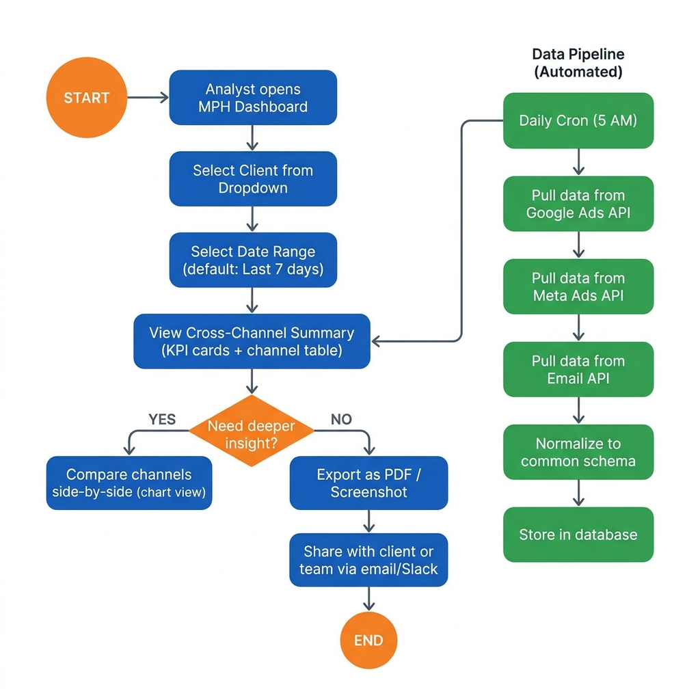

# Task 1 — Marketing Performance Hub (MPH)

## What This Is

A product scoping exercise for an internal marketing performance tool. The goal: help a marketing tech team answer the recurring question — *"How is our marketing performing across channels, and where should we focus?"* — faster, more consistently, and without depending on a single person.

> **This is a scoping exercise, not a full build.** The deliverables focus on defining the right tool, not writing production code.

---

## Deliverables

| File | Description |
|---|---|
| [product_brief.md](product_brief.md) | Full product spec — problem, users, v1 scope, out-of-scope, data strategy, success metrics |
| [architecture.md](architecture.md) | System architecture — data flow, schema, technology choices, API integration plan |
| [walkthrough.md](walkthrough.md) | Written narrative of my thinking process, trade-offs, and decisions |
| [wireframes/](wireframes/) | Dashboard mockup and user flow diagram |

---

## Key Decisions & Reasoning

### 1. Internal-Only Tool (No Client Portal in v1)

The primary user is the **internal analyst/strategist**, not the client. Building for clients adds authentication, permissions, white-labeling, and data sensitivity controls — each a significant scope increase. Analysts can export PDFs and screenshots to serve clients without a dedicated portal.

### 2. Channel-Level, Not Campaign-Level

v1 shows performance **per channel** (Google Ads, Meta Ads, Email, etc.), not per campaign or ad group. Campaign-level drill-downs would essentially replicate the native ad platforms. Staying at the channel level keeps the tool focused on cross-channel comparison — the one thing the existing tools do not do well together.

### 3. Daily Batch Ingestion, Not Real-Time

Marketing performance decisions are not made in real-time. A daily refresh (running at 5 AM before the workday) provides fresh-enough data while keeping the architecture simple. Real-time ingestion adds streaming infrastructure, webhook management, and cost — all unnecessary for this use case.

### 4. Adapters Per Source (Not a Monolith)

Each data source (Google Ads, Meta, Email) gets its own Python adapter that maps platform-specific fields to a common schema. This makes adding new sources a matter of writing one new file, not refactoring the entire ingestion pipeline.

### 5. SQLite for v1 (Upgradeable)

For the data volume involved (few clients × few channels × daily metrics), SQLite is sufficient and requires zero infrastructure. It can be upgraded to PostgreSQL when the team scales, with minimal code changes.

### 6. Trust Through Transparency

The dashboard always shows:
- **Data freshness** — when data was last updated
- **Source attribution** — which API each metric comes from
- **Graceful gaps** — if a source is missing data, it says so clearly instead of showing zeros

---

## What v1 Includes

- Client selector (switch between brands)
- Cross-channel summary (KPI cards: spend, clicks, conversions, ROAS)
- Channel comparison table with visual bars
- Date range filtering (7d, 30d, custom)
- Trend sparklines showing directional movement
- One-click PDF export
- Data freshness indicator

## What v1 Excludes (and Why)

| Feature | Reason for Exclusion |
|---|---|
| Client-facing portal | Auth + permissions + branding = 3 separate projects |
| AI recommendations | Team needs to trust data first, then trust advice |
| Custom report builder | That is a product category (Looker), not a feature |
| Campaign drill-down | Native platforms will always do this better |
| Anomaly detection | Need usage baselines before detecting anomalies |
| Real-time data | Daily is sufficient; real-time adds infra cost |

---

## Wireframes

### Dashboard Mockup

### User Flow Diagram

---

## What I Would Do With More Time

1. **Talk to the actual users** — Sit with an analyst, watch how they currently pull data, and understand their real pain points instead of assuming
2. **Check which tools the team actually uses** — Confirm the exact platforms (Google Ads, Meta, etc.) and make sure their APIs support what we need
3. **Agree on what metrics mean** — For example, "conversions" can mean different things on different platforms. I'd sit with the team and define these clearly
4. **Build a clickable demo** — Create a rough working version, show it to 2–3 analysts, and see if it actually solves their problem before building the full thing
5. **Plan for things going wrong** — What if an API stops working? What if a client has no data for a channel? I'd design how the tool handles these situations
6. **Load old data** — When a new client is added, figure out how to bring in their past data so the dashboard isn't empty on day one

---

## How to Navigate This Submission

**Start here** → Read the [Product Brief](product_brief.md) for the full scope and reasoning.

**Understand the system** → See the [Architecture](architecture.md) for data flow and technical design.

**Understand my thinking** → Read the [Walkthrough](walkthrough.md) for the narrative behind every decision.

**See the UI** → Check the [wireframes/](wireframes/) folder for visual mockups.
